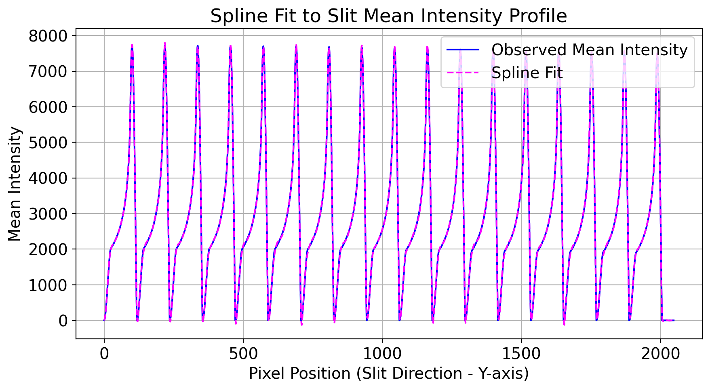

# Echelle Spectrograph Calibration and Detector Analysis

---

## 📄 Abstract

This project implements a sample of spectral detector calibration pipeline using raw echelle spectrograph data. The calibration includes bias and noise estimation, flat field normalization, spectral order tracing, and final wavelength calibration based on known spectral lines. The project highlights programming practice in scientific data analysis, and supports further research and development in spectroscopy and optical instrumentation.


## 📚 Overview

1. **A: Data Loading**  
   Load all raw `.mat` files from the spectrograph: dark frames, flat field, white lamp, and calibration lamp.

2. **B: Dark Frame Analysis**  
   Calculate pixel-wise mean (bias map) and standard deviation (noise map) from dark frames.

3. **C: Flat Field Fitting**  
   Fit polynomial curves to trace spectral orders in the flat field.

4. **D: Slit Profile Fitting**  
   Analyze the spatial intensity profile along the slit direction (Y-axis).

5. **E: Pixel Sensitivity Analysis**  
   Estimate the relative sensitivity of each pixel using white lamp spectrum and flat field.

6. **F: Calibration Peak Detection**  
   Detect emission lines from calibration lamp spectrum using Gaussian fitting.

7. **G: Wavelength Calibration**  
   Fit pixel-to-wavelength mapping using detected peaks and traced orders.

8. **H (Planned): Uncertainty-Based Calibration Refinement**  
   Improve wavelength mapping using noise-based weighting from Task B.


## 📁 Repository Structure

```
Echelle-Spectrograph-Calibration/
│
├── scripts/              # All processing scripts for Tasks A–H
├── data/                 # Sample of raw .mat input files
├── plots/                # Example output plots for each processing step
├── results/              # JSON, CSV, MAT results              
├── README.md             # Project description
├── requirements.txt      # Dependencies
```

---

## 💻 Installation

Clone the repository and install dependencies using pip:

```bash
git clone https://github.com/Alireza-Dehghanpour/Echelle-Spectrograph-Calibration.git
cd Echelle-Spectrograph-Calibration
pip install -r requirements.txt
```

---

## ⚙️ Usage

All scripts are located in the `scripts/` folder. You can run each task sequentially:

```bash
python scripts/TaskA_read-all-data.py
python scripts/TaskB_DarkFrame.py
...
python scripts/TaskG_Wavelength_calibration.py
```

Make sure to adjust file paths inside each script to point to your local data directory.

Optional plotting and result outputs are saved in `plots/` and `results/`.

---

## ⚙️ Requirements

- Python 3.8+
- numpy
- scipy
- matplotlib
- pandas
- scikit-learn


---

  

---

## 👨‍💻 Developer Notes

🧩 **Scripts developed by Alireza Dehghanpour, 2025.**  
📧 Contact: [a.r.dehghanpour@gmail.com](mailto:a.r.dehghanpour@gmail.com)

---
